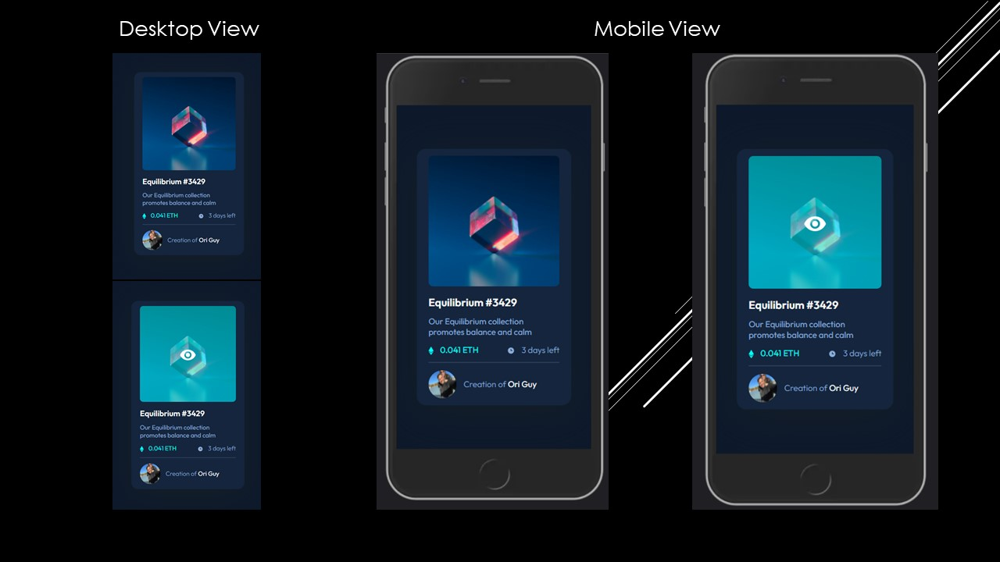

# NFT preview Card Component

Preview Card Component - a card component with an image of an item, the name of the item, the description of the item, the price and time left for the price, and the developer name

## Table of contents

- [Overview](#overview)
  - [The challenge](#the-challenge)
  - [Screenshot](#screenshot)
  - [Links](#links)
- [My process](#my-process)
  - [Built with](#built-with)
  - [What I learned](#what-i-learned)
  - [Continued development](#continued-development)
  - [Useful resources](#useful-resources)
- [Author](#author)

## Overview

### The challenge

Users should be able to:

- View the optimal layout depending on their device's screen size (Responsive Design)
- See hover states for interactive elements
### Screenshot



### Links

- GitHub URL: https://github.com/origuy/Preview-Card-Component
- Live Site URL: https://previewcardcomponentoriguy.netlify.app

## My process

### Built with

- Semantic HTML5 markup
- SCSS custom properties
- Flexbox
- CSS Grid
- Mobile-first workflow

### What I learned

* How to work with Github and Git Bash
* How to make the design responsive and apply touch abilities with  javaScript

```js
overlayTapDisplay.addEventListener('touchstart', showOverlay);
```

### Continued development

I will continue focus on:

- Focus to master SCSS technique.
- Focus on bootstrap doc to learn more about the framework
- Focus on semantic and accessible HTML
- Focus on work with figma design files to simulates the real work project.
- Focus on estimated time for the projects and made the deadline without delays.

### Useful resources

- [w3schools](https://www.w3schools.com/) - the site help me with bootstrap doc, and understand the semantics and accessibility of the website.
- [sass-lang](https://sass-lang.com/) - the site help me with the concept of how to right SCSS the right way and all the different compatibilities.

## Author

- Website - [Ori Guy](https://github.com/origu)
